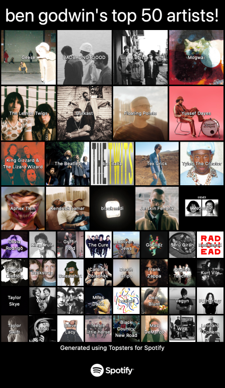

# Topsters for Spotify (draft)
Create and download topsters based on your Spotify listening data!



## Pre-requisites

To run this project you will need:

- A [Node.js LTS](https://nodejs.org/en/) environment or later.
- A Spotify Account

## Usage

Clone the repository, ensure that you are in the `app` directory and run:

```bash
npm install
npm run dev
```

