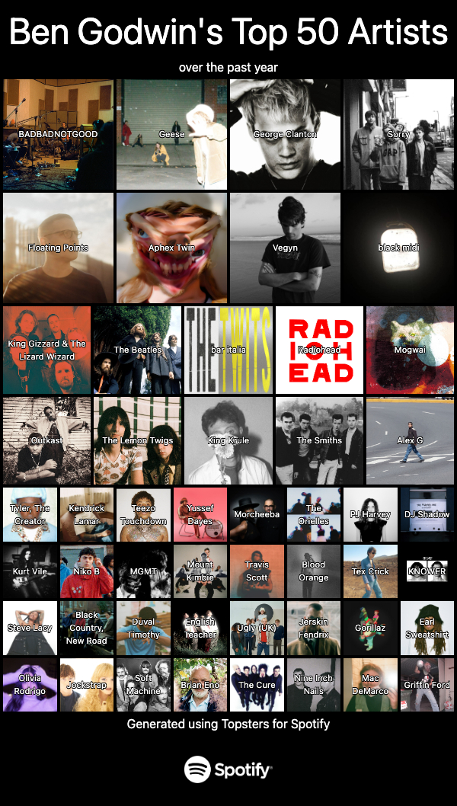

# Topsters for Spotify
Create and download topsters based on your Spotify listening data!



## Pre-requisites

To run this project you will need:

- A [Node.js LTS](https://nodejs.org/en/) environment or later.
- A Spotify Account

This project will run best on Google Chrome

## Usage

Clone the repository, go to the `frontend` directory and run:
```bash
npm install
npm run dev
```

Then go to the `backend` directory and run
```bash
npm install
node backend.js
```

## Features
- Log in with Spotify using OAuthv2
- Create a graphic displaying your 50 top artists over the past 1, 6 or 12 months
- Toggle text displaying artist names
- Download graphic

## Features coming soon
- Create a format where you can list the names on the side instead of as an overlay
- Make the graphic more customisable (e.g. number of artists, color of background)
- Adding persistence to backend - can see what has changed from last visit
- Song topsters using album covers
- Make further artist recommendations using the recommendations API
